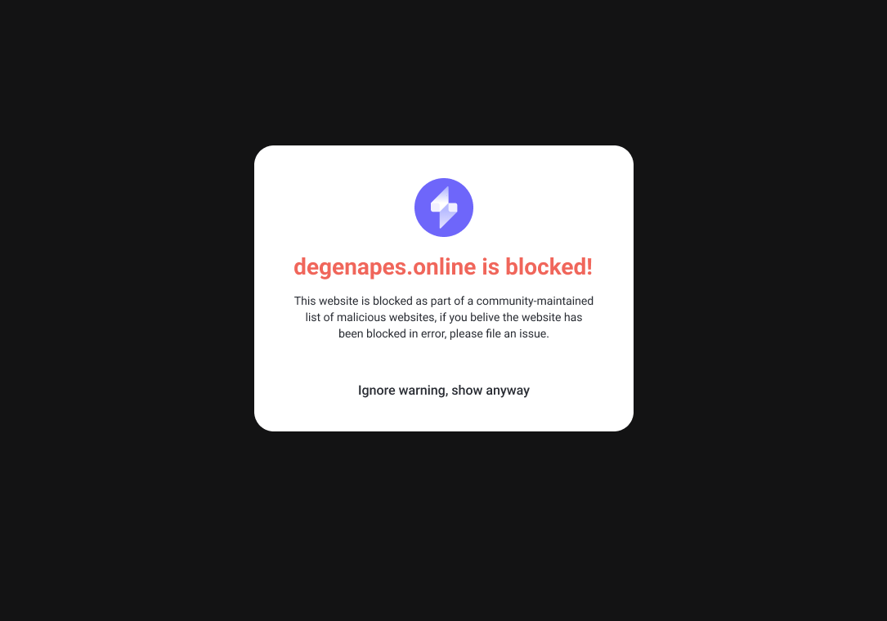

## High Level

This repository is the single source of truth for URLs that are flagged as malicious by the Slope Wallet extension. When a user navigates to a URL that is listed in this repository, they will be redirected to the Slope Wallet Blocklist Page.

The Slope Wallet Blocklist Page will warn the user that the URL they are trying to navigate to has been flagged as malicious, provide a link to this repository, and provide a link the user can click on to navigate to the site anyway. If the user chooses to navigate to the URL anyway, the URL will be added to a local user whitelist and the extension will no longer redirect the user when they navigate to the site in the future.

In addition, if a dApp on a flagged URL tries to send a connection request to a user, the user will be presented with a warning on the connection screen that they are about to connect to a dApp that has been flagged as malicious. A user can choose to ignore this warning and connect anyway.

**NOTE**: The Slope Wallet extension does **NOT** collect any user browsing data, the blocklist is stored locally in the extension and all URL checks are performed locally. Slope Wallet will occasionally ping our own endpoint to download the latest version of the blocklist data, so when a new URL is added it will be quickly reflected for all users. It will take less than 15 minutes for a new site added to the blocklist.json file to be blocked on all users browsers.